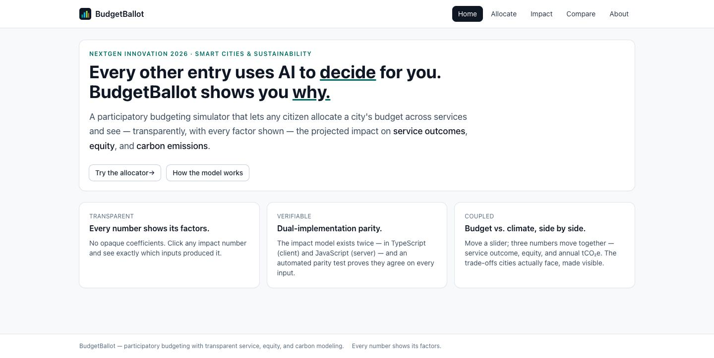
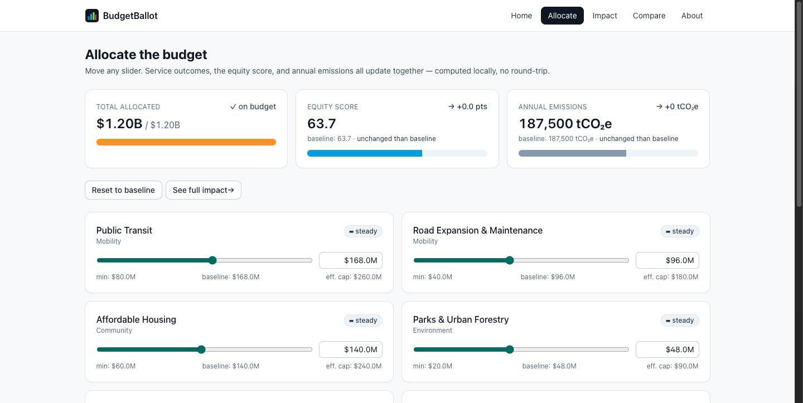
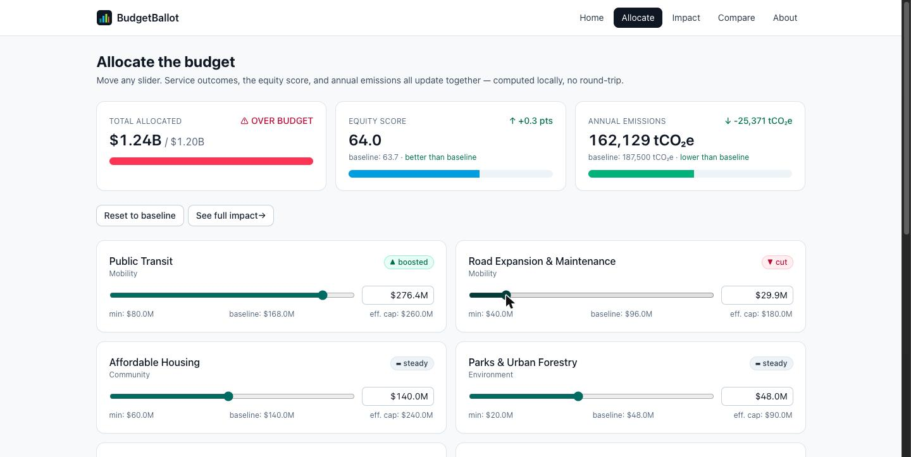
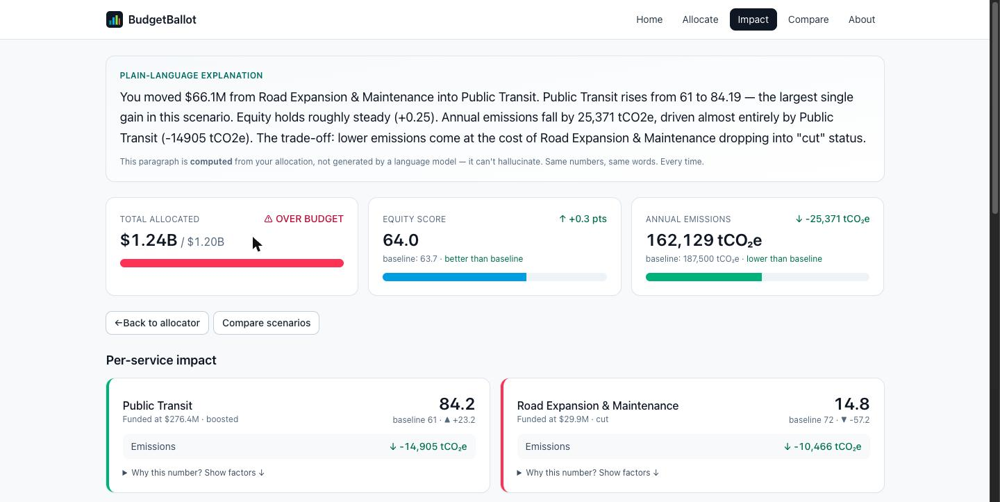
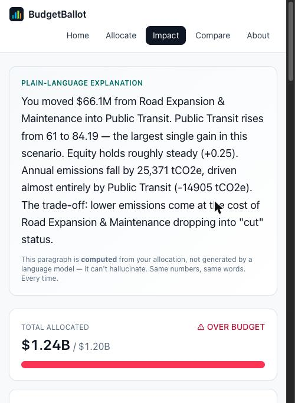

# BudgetBallot

**A participatory budgeting simulator that shows its work.** Allocate a city's budget across 12 services and watch service outcomes, equity, and carbon emissions move together — with every number traceable to the factors that produced it.

> ### Every other entry uses AI to *decide* for you. BudgetBallot shows you *why*.

**🔗 Live demo: https://bbfinal-mu.vercel.app**
**📊 Submission:** NextGen Innovation 2026 · Theme: 🏙️ **Smart Cities & Sustainability**

`90 tests passing` · `2 engines, proven equal` · `12 services modeled` · `0 LLM calls` · `WCAG AA`



---

## Table of contents

[The problem](#the-problem) · [What it does](#what-it-does) · [What makes it different](#what-makes-it-different) · [The carbon coupling](#the-carbon-coupling) · [The narrator](#the-narrator-computed-not-generated) · [Architecture](#architecture) · [Quick start](#quick-start) · [Testing](#testing) · [Accessibility](#accessibility) · [Security](#security-posture) · [Data provenance](#data-provenance) · [Deployment](#deployment) · [Roadmap](#roadmap)

---

## The problem

City budgets are decided in rooms most residents never enter, using models most residents never see. "Participatory budgeting" in practice usually means a survey — you state a preference, and no one shows you what it would cost or what it would break.

Meanwhile the tools that *do* model this are either proprietary consultancy spreadsheets or, increasingly, black-box AI that returns a recommendation with no derivation. Neither is auditable. Neither teaches you anything.

**A budget is a chain of trade-offs. If you can't see the chain, you can't argue with it.**

---

## What it does

- **Allocate** a $1.2B general fund across 12 services with live sliders
- **See three consequences at once** — service outcome, equity score, annual tCO₂e — recomputed on every keystroke, locally, with no round-trip
- **Read a plain-language explanation** of what your allocation did and why
- **Expand any number** to see the exact factors that produced it
- **Compare scenarios** side by side
- **Save and share** allocations via an authenticated API

---

## Screenshots

| Allocator — the three coupled meters | The trade-off, live |
|---|---|
|  |  |

**Impact view with computed narration**


**Responsive at 375px**



---

## What makes it different

### 1. Dual-implementation parity — the model exists twice, and we prove they agree

The impact model is implemented **independently in two languages**: [`src/engine/impact.ts`](src/engine/impact.ts) (TypeScript, runs in the browser for instant slider feedback) and [`server/engine.js`](server/engine.js) (JavaScript, runs on the server as the authoritative source).

Two implementations of the same math is normally a bug factory. So [`src/engine/parity.test.ts`](src/engine/parity.test.ts) drives **both** with the baseline allocation, pseudo-random allocations, and every service swept across its full funding range — and fails the build if they ever disagree.

**This is why the UI can be instant and the server can still be authoritative.** It is the strongest engineering claim in this project, and it is checkable in ten seconds: clone, `npx vitest run`.

### 2. Every number shows its factors

No opaque coefficients. Each `ServiceImpact` carries a `Factor[]` breakdown — expand any figure in the UI and you see the inputs, weights, and intermediate values that produced it. The model is auditable by a resident, not just by its author.

### 3. Budget and climate, coupled

Most civic budget tools stop at dollars. Every service here also carries emissions characteristics, so funding decisions have a climate consequence in the same breath as a service consequence. **Some services cut emissions when funded (transit, parks); some raise them (road expansion).** That sign difference is what creates genuine trade-offs rather than a single optimizable score.

---

## The carbon coupling

Move **$66.1M** from Road Expansion & Maintenance into Public Transit:

| Dimension | Effect |
|---|---|
| **Service outcome** | Transit reliability **61 → 84.2** (▲ 23.2) — the largest single gain |
| **Annual emissions** | **−25,371 tCO₂e** below baseline, driven almost entirely by transit |
| **Equity** | 63.7 → 64.0 (▲ 0.3) |
| **The cost** | Road maintenance drops **57.2** into `cut` status |
| **Budget** | $1.24B against a $1.20B cap — **over budget** |

That last row matters. The tool does not let you pretend the money appeared from nowhere; it shows you the constraint you just broke. Every figure above is reproducible by moving the two named sliders — nothing here is hand-written.

---

## The narrator (computed, not generated)

The Impact view opens with a paragraph like this:

> *"You moved $66.1M from Road Expansion & Maintenance into Public Transit. Public Transit rises from 61 to 84.19 — the largest single gain in this scenario. Equity holds roughly steady (+0.25). Annual emissions fall by 25,371 tCO2e, driven almost entirely by Public Transit (−14905 tCO2e). The trade-off: lower emissions come at the cost of Road Expansion & Maintenance dropping into "cut" status."*

It is produced by [`src/engine/narrate.ts`](src/engine/narrate.ts) — a **pure function over the impact report**. No API call, no model, no key, no network.

**Why this matters:** the same allocation always yields the same words. It cannot hallucinate a number that the model did not compute, because it has no capacity to invent one. In a category where most tools are wrappers around a language model, an explanation that is *derived* rather than *generated* is the stronger guarantee — and it works offline, forever, for free.

Sentence structure varies with which factor was decisive: a scenario dominated by an equity gain reads differently from one dominated by a carbon trade-off. Tested in [`src/engine/narrate.test.ts`](src/engine/narrate.test.ts), including an assertion that four different scenarios produce four structurally different paragraphs.

---

## Architecture

```
Browser                              Server
┌────────────────────────┐          ┌─────────────────────────┐
│  React + Vite + TS     │          │  Express                │
│                        │          │                         │
│  views/Allocate ───────┼──┐       │  GET  /api/health       │
│  views/Impact          │  │       │  GET  /api/dataset      │
│  views/Compare         │  │       │  POST /api/impact       │
│                        │  │       │  GET  /api/scenarios    │
│  engine/impact.ts   ◄──┼──┘       │  POST /api/scenarios 🔒 │
│    (instant feedback)  │          │  DEL  /api/scenarios 🔒 │
│  engine/narrate.ts     │          │                         │
└───────────┬────────────┘          │  engine.js  (authoritative)
            │                       │  store.js   (JSON persist)
            │  parity.test.ts       │  validate.js
            └──────── proves ───────┤
                    equal           └─────────────────────────┘
```

Full detail in [`ARCHITECTURE.md`](ARCHITECTURE.md).

**Stack:** React 18 · TypeScript 5.5 · Tailwind 3 · Vite 5 · Express 4 · Vitest 2. No state library, no component framework, no LLM SDK.

---

## Quick start

```bash
git clone https://github.com/skodityala/budgetballot.git
cd budgetballot
npm install

# Run tests (90 passing)
npx vitest run

# Development — client + API together
BUDGETBALLOT_WRITE_KEY=devkey npm run dev

# Production build + serve
npm run build
BUDGETBALLOT_WRITE_KEY=devkey npm start
```

Open http://localhost:4173. The write key is only needed for saving scenarios; reading and allocating work without it.

---

## Testing

```
npx vitest run    →  90 passing / 0 failing
npm run build     →  exit 0  (tsc --noEmit && vite build)
```

Coverage spans: the impact model, the carbon model, engine parity, the narrator, API authentication and rate limiting, input validation, persistence, and WCAG contrast ratios. There is also a behavioral test asserting the carbon **sign convention** holds across all 12 services — i.e. that funding transit reduces emissions while funding road expansion increases them.

The test suite includes a case that finds an allocation which **improves service outcomes while worsening carbon**. That test is the product thesis in executable form: if trade-offs stopped existing, the suite would fail.

---

## Accessibility

Targeted **WCAG 2.1 AA**. Implemented and tested:

- **Skip-to-content** link, visible on focus
- **Keyboard-operable sliders** with `aria-valuetext` announcing meaningful values — *"168 million dollars, boosted above baseline"* rather than a raw number
- **Live regions** (`aria-live="polite"`) on all three meters, so screen readers hear the numbers change
- **Never color alone** — every status carries a glyph and a word (`▲ boosted`, `▬ steady`, `▼ cut`), so the UI is readable in greyscale
- **Contrast** verified against AA; a regression test asserts the previously-failing accent value (3.03:1) is rejected
- `prefers-reduced-motion` honored · one `<h1>` per view · table `caption`/`scope` · route announcer for SPA navigation

---

## Security posture

Honest table — what is protected, what is not, and why:

| Surface | Status |
|---|---|
| `GET /api/dataset`, `/api/impact`, `/api/scenarios` | **Public by design.** This is a civic transparency tool; reads should not require credentials. |
| `POST /api/scenarios` | **Authenticated** — Bearer token or `x-write-key` header |
| `DELETE /api/scenarios/:id` | **Authenticated** |
| Rate limiting | Token bucket, 20 req/min/IP, in-process, no dependencies |
| Input validation | Rejects unknown service IDs, negative and non-finite values, oversized payloads |
| Scenario IDs | `crypto.randomUUID()` — no `Math.random` anywhere |
| Errors | JSON only; no stack traces leak to clients |

**Known limitations, stated plainly:** the write key is a single shared secret, not per-user auth — appropriate for a demo, not for multi-tenant production. Persistence is a JSON file, which degrades to in-memory on read-only filesystems (as on serverless hosts). Neither is hidden; both are on the roadmap.

---

## Data provenance

**The figures in this model are illustrative, not measurements.** From [`server/seed.js`](server/seed.js), verbatim:

> *"Figures are realistic, round-number illustrations modeled on a mid-size U.S. city (~250k residents, ~$1.2B general fund). They are intentionally tractable so the demo always works offline with no API key."*

The modeled city ("Ridgeport", pop. 248,000, $1.2B general fund, 187,500 tCO₂e baseline) is a composite. Service categories, funding bands, and emissions directions are grounded in how real municipal budgets are structured — but **no figure here should be cited as data about a real place.** Swapping in a real city's open budget data is a matter of replacing one file.

---

## Deployment

Deployed on Vercel; [`render.yaml`](render.yaml) is committed for Render. See [`DEPLOY.md`](DEPLOY.md).

```bash
node -e "console.log(require('crypto').randomBytes(32).toString('hex'))"   # generate key
vercel env add BUDGETBALLOT_WRITE_KEY production
vercel --prod
```

**One deployment note worth recording:** Vercel CLI 58 rejects top-level `functions`/`buildCommand`/`outputDirectory` when it auto-detects a service, and a services-based config silently skips building `api/` — which makes `/api/*` fall through to the SPA rewrite and return HTML. This repo uses the explicit `builds` schema, which deploys the Express handler correctly.

---

## Roadmap

- **Real city data** — ingest published municipal budgets; the dataset is one file
- **Per-user auth** replacing the shared write key, so scenarios belong to people
- **Durable persistence** (Postgres) replacing the JSON store
- **Deliberation features** — comment on and fork someone else's scenario
- **Emissions sourcing** — replace illustrative elasticities with published factors per service category
- **Deep-linkable scenarios** so an allocation survives a page refresh and can be shared as a URL

---

## Team

NextGen Innovation 2026 · Theme: Smart Cities & Sustainability

*(team details on the Devpost submission)*

---

## License

See [`LICENSE`](LICENSE).
